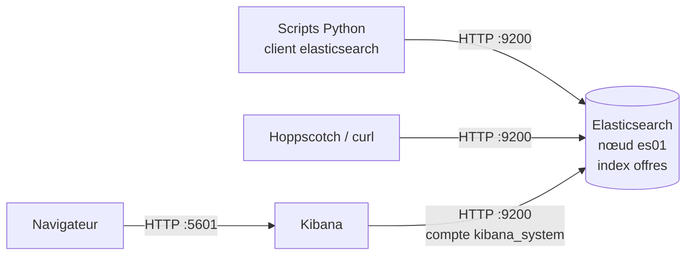

# TP — Introduction à Elasticsearch

## Présentation

Dans ce TP, vous déployez Elasticsearch et Kibana en Docker, indexez 5 000 offres d'emploi IT, écrivez des recherches full-text et des agrégations, puis livrez un mini-moteur de recherche en Python.

**Prérequis :** bases NoSQL orienté document (JSON, MongoDB), Docker Compose, Python 3.

**Rendu :** vous rendez votre travail dans un **dépôt GitHub personnel**, créé avant de commencer à partir du kit fourni (voir « Préparer votre dépôt de travail »). Committez après chaque partie ; transmettez le lien du dépôt au formateur à la fin du TP (dépôt public, ou privé avec le formateur ajouté comme collaborateur). Contenu attendu : voir « Livrables » en fin de document.

**Objectifs — à la fin du TP, vous savez :**

1. Interroger l'API REST avec Kibana Dev Tools, Hoppscotch et curl ; expliquer index, document, shard, réplica et index inversé, et situer Elasticsearch par rapport à MongoDB.
2. Définir un mapping explicite et choisir entre `text` et `keyword`.
3. Écrire des requêtes Query DSL : `match`, `multi_match`, `bool`, `range`, `term`.
4. Observer l'effet d'un analyseur (`standard` vs `french`) avec l'API `_analyze`.
5. Ingérer en masse avec le client Python officiel (`helpers.bulk`).
6. Produire des agrégations (`terms`, `avg`, `range`, `date_histogram`).

**Déroulé**

| Séquence | Livrable |
| --- | --- |
| Mise en place, outils (exercice 0) | Cluster « green », Kibana accessible |
| Partie 1 — Concepts, CRUD, mapping | `requetes/partie1.txt` |
| Partie 2 — Ingestion en Python | `ingest.py` |
| Partie 3 — Recherche et analyseurs | `requetes/partie3.txt` |
| Partie 4 — Agrégations | `requetes/partie4.txt` |
| Mini-défi et restitution | `search.py` |

**Versions utilisées**

| Composant | Version | Remarque |
| --- | --- | --- |
| [Elasticsearch](https://github.com/elastic/elasticsearch/releases) | 9.5.4 | Image `docker.elastic.co/elasticsearch/elasticsearch:9.5.4` |
| Kibana | 9.5.4 | Même version que le cluster, obligatoire |
| [Client Python `elasticsearch`](https://pypi.org/project/elasticsearch/) | 9.5.1 | Requiert Python ≥ 3.10 ; majeure 9 = compatible serveur 9.x |
| Python | 3.12 ou plus récent | Environnement virtuel `venv` |
| Docker Compose | v2 (`docker compose`) | Clé `version:` absente du fichier (obsolète) |

## Elasticsearch et Kibana en bref

Elasticsearch stocke et recherche des documents JSON ; Kibana est l'interface web qui permet de l'explorer, de le visualiser et de l'administrer. Les deux forment le cœur de la « Stack Elastic ».

### Elasticsearch

Elasticsearch est un **moteur de recherche et d'analyse distribué**, écrit en Java et construit sur la bibliothèque de recherche Apache Lucene. Ses caractéristiques principales :

- **Orienté document** : vous lui envoyez des objets JSON, comme à MongoDB.
- **Tout est indexé** : chaque champ est indexé à l'écriture, ce qui rend la recherche rapide sur des millions de documents.
- **Pertinence** : les résultats d'une recherche textuelle sont triés par un score qui mesure à quel point chaque document correspond.
- **API REST** : toute interaction passe par des requêtes HTTP (port 9200) avec des corps JSON ; n'importe quel outil HTTP peut donc l'interroger.
- **Distribué** : les données sont réparties sur plusieurs machines pour tenir la charge et survivre à une panne. Ce TP utilise une seule machine.

Usages typiques : barre de recherche d'un site ou d'un catalogue, centralisation et analyse de logs (observabilité), détection d'incidents de sécurité (SIEM), recherche sémantique par vecteurs. Elasticsearch n'est **pas** conçu pour être la base de données transactionnelle principale d'une application : vous y copiez généralement des données dont la source de vérité est ailleurs.

### Kibana

Kibana est une **application web** (port 5601) qui se connecte à Elasticsearch. Elle ne stocke pas les données métier : elle les lit et les écrit dans Elasticsearch. Les écrans utilisés dans ce TP :

| Écran | Chemin dans le menu | Usage |
| --- | --- | --- |
| Dev Tools (Console) | Management → Dev Tools | Envoyer des requêtes à l'API avec autocomplétion |
| Discover | Analytics → Discover | Parcourir et filtrer les documents |
| Lens / Dashboards | Analytics → Visualize Library, Dashboards | Construire des graphiques et tableaux de bord |
| Stack Management | Management → Stack Management | Gérer index, data views, utilisateurs |

### Architecture du TP



Tous les clients parlent la même API REST : une requête écrite dans Kibana se transpose telle quelle dans Hoppscotch, curl ou Python.

## Glossaire

Les termes sont classés par ordre alphabétique ; la dernière colonne donne un repère approximatif dans un univers connu (SQL ou MongoDB).

| Terme | Définition | Repère |
| --- | --- | --- |
| Agrégation | Calcul statistique sur un ensemble de documents : comptage par catégorie, moyenne, histogramme… | `GROUP BY` + `COUNT`/`AVG` ; pipeline `$group` |
| Analyseur | Chaîne de traitement appliquée à un texte : découpage en mots (tokenizer) puis transformations (minuscules, suppression des mots vides, racinisation). | — |
| API REST | Interface pilotée par des requêtes HTTP : une méthode (`GET`, `PUT`, `POST`, `DELETE`), un chemin (`/offres/_search`) et un corps JSON. | — |
| Bulk | API qui envoie des centaines d'opérations d'écriture en une seule requête HTTP. | `insertMany` |
| Champ | Paire clé/valeur d'un document (`"ville": "Lyon"`). | Colonne |
| Cluster | Ensemble des nœuds qui partagent les mêmes données ; son état de santé est vert, jaune ou rouge. | Replica set, cluster shardé |
| CRUD | Create, Read, Update, Delete : les quatre opérations de base sur un document. | `INSERT`, `SELECT`, `UPDATE`, `DELETE` |
| Data view | Déclaration dans Kibana des index à explorer et de leur champ de date. | — |
| Document | Unité stockée : un objet JSON identifié par un `_id` unique dans son index. | Ligne ; document |
| Filtre (contexte) | Partie d'une requête qui répond oui/non sans calculer de score ; mise en cache. | `WHERE` |
| `geo_point` | Type de champ qui stocke une latitude et une longitude. | Type `geography` ; index `2dsphere` |
| Idempotence | Propriété d'une opération qui produit le même résultat, que vous l'exécutiez une ou plusieurs fois. | — |
| Index | Collection de documents de même nature, avec un mapping commun. | Table ; collection |
| Index inversé | Structure qui associe chaque terme à la liste des documents qui le contiennent, comme l'index d'un livre. | Index full-text |
| `keyword` | Type de champ stocké tel quel, pour les correspondances exactes, tris et agrégations. | `VARCHAR` comparé par `=` |
| Mapping | Schéma d'un index : liste des champs et de leur type. Dynamique (déduit) ou explicite (déclaré). | `CREATE TABLE` ; validator |
| Mot vide | Mot très fréquent et peu porteur de sens (le, des, sur), souvent ignoré par l'analyseur. | — |
| NDJSON | *Newline-Delimited JSON* : un objet JSON complet par ligne. | Format de `mongoimport` |
| Nœud | Une instance d'Elasticsearch (un processus, ici un conteneur). | Un serveur `mongod` |
| Query DSL | Langage de requête d'Elasticsearch, écrit en JSON. | SQL ; MQL |
| Racinisation | *Stemming* : réduction d'un mot à sa racine pour que « donnée » et « données » correspondent. | — |
| Refresh | Opération qui rend visibles à la recherche les documents écrits depuis le précédent (par défaut chaque seconde). D'où le « quasi temps réel ». | — |
| Réplique | Copie d'un shard sur un autre nœud, pour la tolérance aux pannes et la lecture. | Secondaire d'un replica set |
| Score | Nombre calculé pour chaque résultat d'une recherche textuelle (algorithme BM25) : plus il est élevé, plus le document est pertinent. | — |
| Shard | Morceau d'un index. Un index est découpé en shards répartis sur les nœuds. | Shard MongoDB |
| `text` | Type de champ passé dans un analyseur, pour la recherche plein texte. | Index `text` MongoDB |
| Token (terme) | Unité produite par l'analyseur et stockée dans l'index inversé. | — |

## Outils pour envoyer les requêtes

Toutes les requêtes du TP sont des appels HTTP à l'API REST : vous pouvez donc les envoyer avec quatre outils différents, qui produisent exactement le même résultat.

> **Dans ce TP, utilisez Kibana Dev Tools** pour toutes les requêtes des parties 1, 3 et 4 : autocomplétion, aide intégrée et aucune configuration. Le client Python n'est utilisé que là où il faut automatiser (partie 2 et mini-défi). Hoppscotch et curl sont présentés **à titre indicatif** : ce sont les moyens courants d'interroger Elasticsearch en entreprise, en production, là où Kibana n'est pas toujours déployé ou accessible (scripts d'exploitation, supervision, tests d'API, applications).

### Anatomie d'une requête

Dans l'énoncé, les requêtes sont écrites au format de la console Kibana :

```
GET offres/_search
{ "query": { "match": { "description": "agile" } } }
```

| Élément | Ici | Rôle |
| --- | --- | --- |
| Méthode HTTP | `GET` | Lire (`GET`), créer ou remplacer (`PUT`), créer ou déclencher une action (`POST`), supprimer (`DELETE`) |
| Chemin | `offres/_search` | Nom de l'index, puis l'API appelée ; les API système commencent par `_` |
| Paramètres | (aucun) | Après `?`, par exemple `?v` ou `?pretty` |
| Corps | le JSON | Le contenu de la requête, en Query DSL |

La réponse est toujours du JSON, accompagné d'un code HTTP : `200` succès, `201` créé, `400` requête invalide, `401` non authentifié, `404` introuvable.

### Comparatif

| Outil | Points forts | Authentification |
| --- | --- | --- |
| Kibana Dev Tools | Autocomplétion des API et des champs, format compact ; outil principal du TP | Automatique (session Kibana) |
| [Hoppscotch](https://hoppscotch.io) | Client HTTP graphique : codes et en-têtes visibles, collections de requêtes enregistrées, variables d'environnement | Onglet *Authorization* → Basic Auth |
| curl | Terminal et scripts shell, présent sur les trois systèmes (`curl.exe` sous Windows) | Option `-u elastic:<mot_de_passe>` |
| Client Python `elasticsearch` | Automatisation, intégration dans une application (parties 2 et mini-défi) | `basic_auth=(...)` dans `es_client.py` |

### Configurer Hoppscotch (facultatif)

Hoppscotch est un client d'API libre qui s'utilise dans le navigateur (https://hoppscotch.io) ou en application de bureau. Une difficulté : par sécurité, un navigateur bloque les appels d'une page web (hoppscotch.io) vers un autre serveur (`localhost:9200`) si ce serveur ne l'autorise pas explicitement — c'est la politique **CORS**. Elasticsearch ne l'autorise pas par défaut. Il vous faut donc un « intercepteur » qui envoie la requête depuis votre machine.

1. Installez l'**agent Hoppscotch** ou l'**extension navigateur Hoppscotch** (liens dans la [documentation Interceptor](https://docs.hoppscotch.io/documentation/features/interceptor)). Alternative : l'application de bureau, non concernée par CORS.
2. Dans Hoppscotch : **Settings → Interceptors**, sélectionnez *Agent* (saisissez le code affiché par l'agent) ou *Browser extension* (ajoutez `hoppscotch.io` aux origines actives de l'extension). N'utilisez pas l'intercepteur *Proxy* par défaut : il passe par un serveur distant qui ne peut pas joindre votre `localhost`.
3. Créez un environnement `TP ES` avec deux variables : `es_url` = `http://localhost:9200` et `es_password` = votre mot de passe (variable secrète).
4. Dans chaque requête : URL `<<es_url>>/...`, onglet *Authorization* → *Basic Auth*, utilisateur `elastic`, mot de passe `<<es_password>>` ; onglet *Body* → type `application/json`.
5. Enregistrez vos requêtes dans une collection `TP Elasticsearch`, un dossier par partie.

**Règle de conversion Kibana → Hoppscotch / curl :** ajoutez l'adresse du serveur devant le chemin et, pour toute requête avec corps, utilisez `POST` au lieu de `GET` (les navigateurs n'envoient pas de corps avec `GET` ; Elasticsearch accepte `POST` pour `_search`, `_count` et `_analyze`).

| Kibana Dev Tools | Hoppscotch | curl |
| --- | --- | --- |
| `GET offres/_search` + corps | `POST <<es_url>>/offres/_search` + corps JSON | `curl -u elastic:<mdp> -X POST "http://localhost:9200/offres/_search?pretty" -H "Content-Type: application/json" -d '<corps>'` |
| `GET _cat/indices?v` | `GET <<es_url>>/_cat/indices?v` | `curl -u elastic:<mdp> "http://localhost:9200/_cat/indices?v"` |

**curl sous Windows (PowerShell) :** utilisez `curl.exe`. PowerShell gère mal les guillemets d'un JSON passé directement après `-d` ; enregistrez plutôt le corps dans un fichier (par exemple `corps.json`) et passez-le avec `-d "@corps.json"`. Cette forme fonctionne aussi sous macOS et Linux.

## Mise en place

### Selon votre système

Le TP fonctionne sous Windows, macOS et Linux. Les commandes sont écrites pour un terminal, et sont identiques partout sauf quand deux variantes sont données.

| | Windows 10/11 | macOS | Linux |
| --- | --- | --- | --- |
| Terminal | **PowerShell** | Terminal | Terminal |
| Git | [Git for Windows](https://git-scm.com/downloads/win) | `xcode-select --install` ou `brew install git` | Paquet `git` de la distribution |
| Docker | [Docker Desktop](https://docs.docker.com/desktop/) (moteur WSL 2) | Docker Desktop | Docker Engine + plugin `docker-compose-plugin` (ou Docker Desktop) |
| Python ≥ 3.10 | [python.org](https://www.python.org/downloads/) (cochez « Add python.exe to PATH ») ou `winget install Python.Python.3.12` | python.org ou `brew install python` | Paquets `python3` et `python3-venv` |
| Commande Python (hors venv) | `python` | `python3` | `python3` |
| curl | `curl.exe` (fourni avec Windows) | `curl` | `curl` (à installer si absent) |

> **Windows :** dans PowerShell, tapez `curl.exe` et non `curl` : `curl` y est un alias d'une autre commande (`Invoke-WebRequest`) qui n'accepte pas les mêmes options.

Une fois l'environnement virtuel Python activé (étape 5 de « Démarrer la stack »), la commande `python` fonctionne sur les trois systèmes.

### Préparer votre dépôt de travail

Vous ne travaillez pas dans le dépôt du TP : vous en copiez le kit dans un dossier à vous, qui devient votre propre dépôt Git, celui que vous rendez.

1. Clonez le dépôt du TP sur votre machine :

```bash
git clone <url_du_depot_du_TP>
```

2. Copiez le dossier du kit **en dehors** du dépôt cloné, sous le nom de votre choix (avec les commandes ci-dessous, ou avec l'Explorateur / le Finder en veillant à copier aussi les fichiers et dossiers cachés `.env.example`, `.gitignore`, `.gitattributes`, `.editorconfig` et `.vscode`) :

macOS / Linux :

```bash
cp -r TP-intro-elasticsearch-kibana/kit-TP ~/tp-elasticsearch
cd ~/tp-elasticsearch
```

Windows (PowerShell) :

```powershell
Copy-Item -Recurse TP-intro-elasticsearch-kibana\kit-TP $HOME\tp-elasticsearch
cd $HOME\tp-elasticsearch
```

3. Initialisez un dépôt Git dans ce dossier :

```bash
git init -b main
```

Le kit impose des fins de ligne **Unix (LF)** sur tous les systèmes : `.gitattributes` s'applique à Git et prime sur le réglage `core.autocrlf` de Git for Windows ; `.editorconfig` et `.vscode/settings.json` règlent l'éditeur. Ne supprimez pas ces fichiers : sans eux, un fichier édité sous Windows passerait en fins de ligne CRLF, ce qui fait apparaître des différences sur toutes les lignes et casse les scripts exécutés dans les conteneurs Linux.

4. Créez sur GitHub un dépôt personnel **vide** (sans README, ni `.gitignore`, ni licence), par exemple `tp-elasticsearch`, puis reliez-le à votre dossier :

```bash
git remote add origin https://github.com/<votre_compte>/tp-elasticsearch.git
```

5. Faites le premier commit et poussez-le :

```bash
git status                  # vérifiez que .env n'apparaît pas (il est dans .gitignore)
git add .
git commit -m "Kit initial du TP Elasticsearch"
git push -u origin main
```

**Bonnes pratiques de commit**

- **Committez régulièrement** : au minimum à la fin de chaque exercice, avec un message qui dit ce qui a été fait (`Partie 1 : mapping explicite de l'index offres`, et non `modifs`).
- **Poussez après chaque commit** (`git push`) : un commit resté sur votre machine est perdu si le poste tombe en panne ou si vous changez de machine.
- **Vérifiez avant chaque `git add`** avec `git status` : ne versionnez jamais `.env` ni `data/offres.ndjson` (ils sont exclus par `.gitignore`, ne forcez pas leur ajout).
- Un commit n'a pas besoin d'être parfait : mieux vaut un travail en cours sauvegardé qu'un travail terminé perdu.

### Démarrer la stack

Objectif : un nœud Elasticsearch sécurisé (authentification activée) et Kibana, accessibles uniquement depuis votre poste.

**Prérequis poste :** Docker avec 4 Go de RAM disponibles, ports 9200 et 5601 libres, Python ≥ 3.10 (3.12+ recommandé).

**Contenu du kit**

| Fichier | Rôle |
| --- | --- |
| `docker-compose.yml` | Elasticsearch, service `setup` (mot de passe `kibana_system`), Kibana |
| `.env.example` | Version de la stack et mots de passe — à copier en `.env` |
| `data/generate_offres.py` | Génère 5 000 offres fictives (NDJSON), déterministe (`--seed 42`) |
| `es_client.py` | Connexion au cluster via `.env` (fourni) |
| `ingest.py`, `search.py` | Squelettes à compléter (partie 2 et mini-défi) |

**Étapes**

1. Préparez la configuration, puis remplacez les mots de passe et la clé dans `.env` :

```bash
cp .env.example .env        # fonctionne aussi dans PowerShell
python3 -c "import secrets; print(secrets.token_hex(16))"   # clé KIBANA_ENCRYPTION_KEY ; Windows : python au lieu de python3
```

Ouvrez `.env` avec votre éditeur (VS Code, Bloc-notes, TextEdit…) pour y coller les valeurs. Sous macOS et Linux, les fichiers commençant par un point sont masqués dans le Finder et les gestionnaires de fichiers (Cmd + Maj + . dans le Finder pour les afficher).

2. Démarrez la stack et suivez le démarrage :

```bash
docker compose up -d
docker compose ps          # elasticsearch "healthy", setup "exited (0)", kibana "healthy"
```

3. Vérifiez le cluster :

```bash
curl -u elastic:<mot_de_passe> "http://localhost:9200/_cluster/health?pretty"   # attendu : "status" : "green"
```

Sous Windows (PowerShell), remplacez `curl` par `curl.exe`.

4. Ouvrez http://localhost:5601, connectez-vous en `elastic`, puis **Menu → Management → Dev Tools**. C'est là que vous tapez les requêtes des parties 1, 3 et 4 ; Hoppscotch ou curl donnent le même résultat (voir « Outils pour envoyer les requêtes »).
5. Créez et activez l'environnement virtuel Python :

macOS / Linux :

```bash
python3 -m venv .venv
source .venv/bin/activate
```

Windows (PowerShell) :

```powershell
python -m venv .venv
.venv\Scripts\Activate.ps1
```

Si PowerShell refuse d'exécuter le script d'activation (« l'exécution de scripts est désactivée sur ce système »), autorisez-le une fois pour votre compte avec `Set-ExecutionPolicy -Scope CurrentUser RemoteSigned`, puis relancez l'activation.

Le préfixe `(.venv)` apparaît alors dans l'invite. Pensez à réactiver l'environnement à chaque nouveau terminal. Installez ensuite les dépendances et générez le jeu de données (identique sur les trois systèmes) :

```bash
pip install -r requirements.txt
python data/generate_offres.py      # → data/offres.ndjson (5 000 lignes)
```

### Exercice 0 — Vérifier l'accès au cluster

Envoyez `GET /` (informations sur le cluster) depuis Kibana Dev Tools, puis la même requête avec curl (et Hoppscotch si vous l'avez installé) en suivant le tableau de conversion de la section « Outils pour envoyer les requêtes ». Recommencez avec curl **sans** l'option `-u`.

**Questions :** les réponses sont-elles identiques d'un outil à l'autre ? Quel code HTTP obtenez-vous sans authentification, et que dit le message d'erreur ? Pourquoi Kibana n'a-t-il pas besoin que vous lui fournissiez le mot de passe à chaque requête ?

### Le jeu de données : 5 000 offres d'emploi IT

Tout le TP travaille sur un même corpus : **5 000 offres d'emploi fictives dans l'informatique, publiées en France**, comme celles d'un site de recrutement. Votre objectif final est d'en faire un petit moteur de recherche d'offres (mini-défi).

Les offres sont produites par `data/generate_offres.py`. Elles sont fictives pour trois raisons : aucune donnée personnelle ni licence à gérer, un fichier identique pour toute la promotion (même graine aléatoire, `--seed 42`), et des résultats attendus connus à l'avance pour la correction.

Ce que contient le corpus :

- **10 métiers** : développeur Python, Java ou front-end, data engineer, data scientist, ingénieur DevOps, administrateur systèmes, analyste cybersécurité, architecte cloud, administrateur de bases de données ; chacun avec 4 niveaux (Junior, Confirmé, Senior, Lead).
- **12 villes** : Paris (environ 30 % des offres), Lyon, Toulouse, Bordeaux, Nantes, Montpellier, Lille, Marseille, Rennes, Strasbourg, Nice, Grenoble.
- **5 types de contrat** : CDI (2 775 offres), alternance (754), CDD (614), freelance (613), stage (244).
- **14 entreprises** aux noms inventés.
- **Des dates de publication** réparties sur les 6 mois précédant le 30/09/2026.

| Champ | Contenu | Exemple |
| --- | --- | --- |
| `id` | Identifiant unique de l'offre | `OFF-00002` |
| `titre` | Métier + niveau, ou métier + contrat pour alternance et stage | Analyste Cybersécurité Senior |
| `entreprise` | Employeur | Cévennes Data |
| `description` | Texte libre de 5 phrases en français (équipe, missions, compétences attendues) | Vous rejoignez une équipe de 6 personnes… |
| `competences` | Liste de 3 à 5 technologies liées au métier | SIEM, Python, ISO 27001 |
| `ville` | Ville du poste | Paris |
| `localisation` | Latitude et longitude, dans un rayon d'environ 5 km autour du centre-ville | 48.81118, 2.32499 |
| `contrat` | CDI, CDD, Alternance, Freelance ou Stage | CDI |
| `teletravail` | aucun, partiel ou total | partiel |
| `experience_annees` | Expérience demandée, en années (0 à 15) | 5 |
| `salaire_min`, `salaire_max` | Fourchette de salaire annuel brut, en euros ; **absente** pour alternance, stage et freelance (3 389 offres en ont une) | 59 000 – 68 000 |
| `date_publication` | Date de mise en ligne (AAAA-MM-JJ) | 2026-08-02 |

Les salaires suivent le niveau (un Junior gagne moins qu'un Lead) et sont majorés à Paris : les agrégations de la partie 4 vous permettent de le vérifier.

**Exemple d'offre (une ligne du fichier `data/offres.ndjson`)**

```json
{"id": "OFF-00002", "titre": "Analyste Cybersécurité Senior", "entreprise": "Cévennes Data",
 "description": "Vous rejoignez une équipe de 6 personnes travaillant sur des projets publics. …",
 "competences": ["SIEM", "EBIOS RM", "Python", "ISO 27001"], "ville": "Paris",
 "localisation": {"lat": 48.81118, "lon": 2.32499}, "contrat": "CDI", "teletravail": "partiel",
 "experience_annees": 5, "date_publication": "2026-08-02", "salaire_min": 59000, "salaire_max": 68000}
```

Les offres en alternance, stage et freelance n'ont pas de champs `salaire_*` : c'est volontaire (champ absent ≠ valeur nulle).

**Dépannage**

- `max virtual memory areas vm.max_map_count [65530] is too low` :
  - Linux : `sudo sysctl -w vm.max_map_count=262144` (pour le rendre permanent, ajoutez `vm.max_map_count=262144` dans `/etc/sysctl.conf`) ;
  - Windows (Docker Desktop, WSL 2) : `wsl -d docker-desktop -u root sysctl -w vm.max_map_count=262144` ;
  - macOS : réglé par Docker Desktop, redémarrez Docker Desktop si l'erreur apparaît.
- Conteneur `elasticsearch` tué (code 137) : mémoire insuffisante. Baissez `ES_MEM_LIMIT` dans `.env`, ou donnez plus de RAM à Docker :
  - macOS : Docker Desktop → Settings → Resources → Memory ;
  - Windows (WSL 2) : ajoutez `memory=6GB` sous `[wsl2]` dans le fichier `%UserProfile%\.wslconfig`, puis `wsl --shutdown` et redémarrez Docker Desktop ;
  - Linux : pas de limite imposée par Docker, fermez d'autres applications.
- `docker` introuvable ou « Cannot connect to the Docker daemon » : Docker Desktop n'est pas lancé (Windows, macOS) ; sous Linux, vérifiez `sudo systemctl start docker` et que votre utilisateur est dans le groupe `docker`.
- Port 9200 ou 5601 déjà utilisé : un autre Elasticsearch/Kibana tourne sur le poste ; arrêtez-le avant `docker compose up -d`.
- Kibana affiche « Kibana server is not ready yet » : attendez la fin du service `setup` (`docker compose logs setup`).

> Cette configuration est un environnement de laboratoire : nœud unique, TLS HTTP désactivé, ports liés à 127.0.0.1. En production : TLS, plusieurs nœuds, comptes dédiés à moindres privilèges.

## Partie 1 — Concepts, CRUD et mapping

Elasticsearch stocke des documents JSON comme MongoDB, mais il est conçu pour la recherche : chaque champ texte alimente un index inversé (terme → documents) et les résultats sont classés par pertinence (BM25).

| Notion | MongoDB | Elasticsearch |
| --- | --- | --- |
| Conteneur de documents | Collection | Index |
| Schéma | Optionnel (validator) | Mapping, dynamique ou explicite |
| Distribution | Shard (sharding par clé) | Shard primaire + répliques |
| Langage de requête | MQL | Query DSL (JSON), ES\|QL |
| Point fort | Transactions, mises à jour fréquentes | Recherche plein texte, score, agrégations |
| Visibilité d'une écriture | Immédiate | Quasi temps réel (refresh toutes les 1 s par défaut) |

### Notions clés

**Un document** est rangé dans un index et identifié par son `_id`. Chaque réponse l'accompagne de métadonnées : `_index`, `_id`, `_version` (compteur d'écritures), `_seq_no` et `_source` (le JSON d'origine, restitué tel quel).

**Les opérations CRUD**

| Opération | Requête | Effet |
| --- | --- | --- |
| Créer ou remplacer | `PUT index/_doc/<id>` | Écrit le document ; s'il existe, il est remplacé en entier |
| Créer avec un id généré | `POST index/_doc` | Elasticsearch choisit l'`_id` |
| Lire | `GET index/_doc/<id>` | Renvoie le document et ses métadonnées |
| Mettre à jour partiellement | `POST index/_update/<id>` avec `{"doc": {...}}` | Fusionne les champs fournis avec le document existant |
| Supprimer | `DELETE index/_doc/<id>` | Supprime le document |

**Le mapping** décrit le type de chaque champ. Sans mapping déclaré, Elasticsearch le **déduit** du premier document reçu (mapping dynamique) ; une fois fixé, le type d'un champ ne peut plus changer sans recréer l'index. D'où l'intérêt d'un mapping **explicite**, déclaré à la création.

| Type | Contenu | Exemple d'usage |
| --- | --- | --- |
| `text` | Texte analysé, découpé en tokens | Rechercher « développeur python » dans une description |
| `keyword` | Chaîne stockée telle quelle | Filtrer `ville = "Lyon"`, compter par ville, trier |
| `integer`, `long`, `float` | Nombres | Intervalle de salaires, moyenne |
| `date` | Date ou date-heure | Offres des 30 derniers jours, histogramme mensuel |
| `boolean` | `true` / `false` | Offre active ou non |
| `geo_point` | Latitude + longitude | Offres à moins de 20 km |

Un même champ peut être indexé de deux façons grâce aux **sous-champs** (`fields`) : par exemple `titre` en `text` pour la recherche et `titre.brut` en `keyword` pour le tri.

**La santé du cluster** : vert = tous les shards sont alloués ; jaune = des répliques n'ont pas de nœud où aller (cas d'un nœud unique avec 1 réplique) ; rouge = un shard primaire manque, des données sont indisponibles.

Enregistrez toutes vos requêtes Dev Tools dans `requetes/partie1.txt`.

### Exercice 1.1 — Explorer le cluster

```
GET /
GET _cat/nodes?v
GET _cat/indices?v&expand_wildcards=all
```

**Questions :** quelle version tourne ? Combien de nœuds ? Pourquoi voyez-vous des index commençant par un point ?

### Exercice 1.2 — CRUD

```
PUT essai/_doc/1
{ "titre": "Data Engineer", "ville": "Montpellier" }

GET essai/_doc/1

POST essai/_update/1
{ "doc": { "contrat": "CDI" } }

POST essai/_doc
{ "titre": "DevOps", "ville": "Lyon" }

DELETE essai/_doc/1
```

**Questions :** comment évolue `_version` ? Quel identifiant reçoit le document créé par `POST essai/_doc` ? L'index `essai` existait-il avant le premier `PUT` ?

### Exercice 1.3 — Les pièges du mapping dynamique

```
PUT essai2/_doc/1
{ "salaire": "45000", "publication": "2026-08-02", "actif": "true" }

PUT essai2/_doc/2
{ "salaire": 52000 }

GET essai2/_mapping
```

**Questions :** quel type reçoit `salaire` ? Et `publication` ? Pourquoi le document 2 est-il accepté ? Quelle conséquence pour un tri ou un filtre `salaire > 50000` ?

### Exercice 1.4 — Mapping explicite de l'index `offres`

Choisissez un type pour chaque champ, puis créez l'index avec `PUT offres`, `"dynamic": "strict"`, 1 shard et 0 réplique.

| Champ | Usage attendu |
| --- | --- |
| `id`, `entreprise`, `ville`, `contrat`, `teletravail` | Filtre exact, facettes |
| `titre` | Recherche plein texte en français **et** tri/facette sur la valeur brute (sous-champ `brut`) |
| `description` | Recherche plein texte en français |
| `competences` | Filtre exact et facettes **et** recherche plein texte (sous-champ `texte`) |
| `localisation` | Recherche par distance |
| `experience_annees`, `salaire_min`, `salaire_max` | Filtres par intervalle, moyennes |
| `date_publication` | Filtres par date, histogramme mensuel |

Puis vérifiez le verrou :

```
PUT offres/_doc/test
{ "champ_inconnu": 1 }
```

**Questions :** quelle erreur obtenez-vous ? Pourquoi est-ce une bonne pratique en production ? Nettoyez ensuite avec `DELETE essai` et `DELETE essai2`.

## Partie 2 — Ingestion en Python

Objectif : un script idempotent qui (re)crée l'index avec le mapping de l'exercice 1.4 et charge les 5 000 offres via l'API `_bulk`.

Le client officiel se connecte par `es_client.py` (fourni), qui lit `ELASTIC_PASSWORD` dans `.env` : aucun secret dans le code ni dans Git (`.env` est dans `.gitignore`).

### Notions clés

**Pourquoi l'API `_bulk` ?** Indexer 5 000 documents un par un coûte 5 000 allers-retours HTTP. L'API `_bulk` regroupe des centaines d'opérations dans une seule requête, au format NDJSON : une ligne d'action, puis une ligne de document.

```
POST _bulk
{ "index": { "_index": "offres", "_id": "OFF-00001" } }
{ "id": "OFF-00001", "titre": "Développeur Java (Alternance)", "ville": "Paris" }
{ "index": { "_index": "offres", "_id": "OFF-00002" } }
{ "id": "OFF-00002", "titre": "Analyste Cybersécurité Senior", "ville": "Paris" }
```

La réponse contient un statut **par opération** : un document rejeté n'annule pas les autres. La fonction `helpers.bulk` du client Python construit ces lignes et découpe le flux en lots (`chunk_size`).

**Idempotence.** Une ingestion doit pouvoir être relancée sans créer de doublons : vous fixez donc l'`_id` à partir d'un identifiant métier (ici `id`). L'action `index` remplace alors le document existant au lieu d'en créer un second.

**Générateur Python.** Une fonction qui contient `yield` produit les éléments un par un, à la demande. Le fichier est lu ligne à ligne : la mémoire consommée reste la même pour 5 000 ou 50 millions de lignes.

**Refresh.** Un document indexé n'est visible par la recherche qu'après le *refresh* suivant (chaque seconde par défaut). Après une ingestion en masse, un appel explicite à `_refresh` garantit que le comptage est juste ; en production, évitez de le faire à chaque écriture (coûteux).

### Exercice 2.1 — Compléter `ingest.py`

Traitez les `TODO` dans l'ordre :

1. Reportez dans `MAPPINGS` le mapping validé à l'exercice 1.4.
2. Écrivez `lire_actions()` comme un **générateur** (`yield`) : une action `{"_index", "_id", "_source"}` par ligne, sans charger le fichier en mémoire. Ouvrez le fichier avec `encoding="utf-8"` : sans cela, Windows utilise un autre encodage par défaut et les accents sont corrompus.
3. Gérez `--reset` avec `es.indices.delete(index=..., ignore_unavailable=True)`.
4. Créez l'index si `es.indices.exists()` renvoie faux : `es.indices.create(index=..., settings=..., mappings=...)`.
5. Appelez `helpers.bulk(es, actions, chunk_size=1000, raise_on_error=False)` et affichez les éventuelles erreurs.
6. Appelez `es.indices.refresh()` puis affichez `es.count()`.

```bash
python ingest.py --reset
# attendu : Index 'offres' créé / 5000 documents indexés, 0 erreurs, 5000 documents dans 'offres'
```

### Exercice 2.2 — Idempotence et identifiants

Relancez `python ingest.py` **sans** `--reset`.

**Questions :** le nombre de documents a-t-il doublé ? Pourquoi fixer `_id` à partir du champ `id` est-il essentiel ? Que se passerait-il avec des identifiants générés par Elasticsearch ?

### Exercice 2.3 — Provoquer une erreur de mapping

Copiez la dernière ligne de `data/offres.ndjson` à la fin du fichier, changez son `id` en `OFF-99999` et ajoutez un champ `"prime": 3000`, relancez l'ingestion et observez la sortie.

**Questions :** le lot entier est-il rejeté ou seulement ce document ? Quel est l'intérêt de `raise_on_error=False` pour un pipeline ? Régénérez ensuite le fichier propre avec `python data/generate_offres.py`.

### Exercice 2.4 — Vérifier dans Kibana

```
GET _cat/indices/offres?v
GET offres/_count
GET offres/_doc/OFF-00002
```

Puis créez une *data view* `offres` (champ temporel `date_publication`), élargissez la période à « Last 1 year » et parcourez les documents dans **Discover**.

## Partie 3 — Recherche et analyseurs

La règle à retenir : un champ `text` est découpé et normalisé par un analyseur à l'indexation **et** à la recherche ; un champ `keyword` est comparé tel quel. Enregistrez vos requêtes dans `requetes/partie3.txt`.

### Notions clés

**L'analyseur** transforme un texte en une liste de tokens, en trois étapes :

1. **Filtres de caractères** (facultatifs) : nettoyage du texte brut, par exemple suppression de balises HTML.
2. **Tokenizer** : découpage en mots.
3. **Filtres de tokens** : minuscules, suppression des mots vides, élision (`l'`, `d'`), racinisation.

L'analyseur est appliqué deux fois : à l'indexation (pour remplir l'index inversé) et à la recherche (pour transformer la question de la même façon). Une recherche réussit quand les tokens de la question retrouvent ceux du document.

**Le score** (algorithme BM25) augmente quand le terme cherché apparaît souvent dans le document, qu'il est rare dans l'ensemble de l'index et que le champ est court. Un mot rare et présent dans un titre court pèse donc plus qu'un mot courant noyé dans une longue description.

**Contexte requête ou contexte filtre.** En contexte requête, Elasticsearch se demande « à quel point ce document correspond-il ? » et calcule un score. En contexte filtre, il se demande seulement « correspond-il, oui ou non ? » : pas de score, et le résultat peut être mis en cache.

**Familles de requêtes utilisées**

| Requête | Champ visé | Ce qu'elle fait |
| --- | --- | --- |
| `match` | `text` | Analyse la question puis cherche ses tokens (OU par défaut) |
| `multi_match` | plusieurs `text` | Un `match` sur plusieurs champs, avec pondération possible (`titre^3`) |
| `match_phrase` | `text` | Les tokens doivent se suivre dans l'ordre |
| `term`, `terms` | `keyword`, nombre, date | Valeur exacte, sans analyse |
| `range` | nombre, date | Intervalle : `gt`, `gte`, `lt`, `lte` |
| `geo_distance` | `geo_point` | Documents à moins d'une distance donnée d'un point |
| `bool` | — | Combine d'autres requêtes (tableau ci-dessous) |

| Clause de `bool` | Obligatoire ? | Influence le score ? |
| --- | --- | --- |
| `must` | Oui | Oui |
| `filter` | Oui | Non |
| `should` | Non si `must` ou `filter` est présent (bonus de score) | Oui |
| `must_not` | Exclusion | Non |

### Exercice 3.1 — Voir travailler un analyseur

```
POST _analyze
{ "analyzer": "standard", "text": "Les développeuses travaillaient sur l'analyse des données" }

POST _analyze
{ "analyzer": "french", "text": "Les développeuses travaillaient sur l'analyse des données" }
```

**Questions :** quels mots disparaissent avec `french` ? Que devient `l'analyse` ? Analysez « donnée » puis « données » avec chaque analyseur : obtenez-vous le même terme ? Qu'en déduisez-vous pour la recherche ?

### Exercice 3.2 — `match` contre `term`

```
GET offres/_search
{ "query": { "match": { "description": "projets bancaires" } } }

GET offres/_search
{ "query": { "term": { "ville": "paris" } } }

GET offres/_search
{ "query": { "term": { "titre": "Data Engineer Senior" } } }
```

**Questions :** pourquoi les deux requêtes `term` renvoient-elles 0 résultat ? Corrigez-les (indice : valeur exacte, sous-champ `brut`). Relancez la première avec `"operator": "and"` : que change le nombre de résultats ?

### Exercice 3.3 — Plusieurs champs, pondération et fautes de frappe

Cherchez « kubernetis terraform » dans `titre`, `competences.texte` et `description` avec un `multi_match`. Ajoutez `"fuzziness": "AUTO"`, puis un poids `titre^3`.

**Questions :** quel paramètre rattrape la faute ? Comment évolue l'ordre des résultats avec le poids sur `titre` ?

### Exercice 3.4 — Requête `bool`

Écrivez une seule requête qui renvoie les offres :

- dont le titre ou la description parle de « données » (`must`) ;
- en CDI, à Montpellier ou Toulouse, avec `salaire_max` ≥ 50 000 (`filter`) ;
- sans télétravail `aucun` (`must_not`) ;
- mieux classées si `competences` contient `Elasticsearch` (`should`).

**Questions :** comparez les `_score` avec et sans le bloc `should`. Pourquoi placer les critères exacts dans `filter` plutôt que dans `must` (deux raisons) ?

### Exercice 3.5 — Recherche géographique

Listez les offres à moins de 20 km de Montpellier (43.6108, 3.8767), triées de la plus proche à la plus lointaine :

```
GET offres/_search
{
  "query": { "bool": { "filter": { "geo_distance": {
    "distance": "20km", "localisation": { "lat": 43.6108, "lon": 3.8767 } } } } },
  "sort": [ { "_geo_distance": {
    "localisation": { "lat": 43.6108, "lon": 3.8767 }, "order": "asc", "unit": "km" } } ]
}
```

### Exercice 3.6 — Pagination et surlignage

Reprenez la requête 3.4 : affichez la page 2 par pages de 5 (`from`, `size`), limitez `_source` à `titre`, `entreprise`, `ville` et ajoutez un `highlight` sur `description`.

**Question :** pourquoi `from` + `size` est-il limité à 10 000 par défaut, et quelle API utiliser au-delà (`search_after` avec un *point in time*) ?

## Partie 4 — Agrégations

Les agrégations calculent des statistiques sur les documents qui correspondent à la requête, en un seul aller-retour. Utilisez `"size": 0` quand seuls les chiffres comptent. Enregistrez vos requêtes dans `requetes/partie4.txt`.

### Notions clés

Il existe deux grandes familles d'agrégations, que vous combinez :

| Famille | Rôle | Exemples | Équivalent SQL |
| --- | --- | --- | --- |
| **Regroupement** (*bucket*) | Répartit les documents dans des paquets et compte chaque paquet (`doc_count`) | `terms`, `range`, `date_histogram` | `GROUP BY` |
| **Métrique** | Calcule une valeur sur un ensemble de documents | `avg`, `min`, `max`, `sum`, `stats`, `cardinality` | `AVG()`, `COUNT(DISTINCT)` |

Une agrégation placée **dans** une autre s'applique à chaque paquet de la première : `terms` sur `ville` contenant `avg` sur `salaire_min` donne le salaire moyen de chaque ville.

```
"aggs": {
  "<nom choisi>": {
    "<type>": { "field": "..." },
    "aggs": { "<sous-agrégation>": { ... } }
  }
}
```

Trois règles pratiques : les regroupements par valeur se font sur des champs `keyword`, numériques ou dates (pas sur `text`) ; les agrégations ne portent que sur les documents sélectionnés par `query` ; `"size": 0` supprime la liste des résultats quand seules les statistiques comptent.

### Exercice 4.1 — Offres et salaire moyen par ville

```
GET offres/_search
{
  "size": 0,
  "aggs": {
    "par_ville": {
      "terms": { "field": "ville", "size": 12, "order": { "salaire_moyen": "desc" } },
      "aggs": { "salaire_moyen": { "avg": { "field": "salaire_min" } } }
    }
  }
}
```

**Questions :** quelle ville a le salaire moyen le plus élevé ? Sur combien d'offres la moyenne est-elle réellement calculée (rappel : champ absent pour certains contrats) ? Remplacez `ville` par `titre` : quelle erreur, et comment la corriger ?

### Exercice 4.2 — Publications par mois

Produisez le nombre d'offres publiées par mois avec un `date_histogram` sur `date_publication` (`"calendar_interval": "month"`), puis ventilez chaque mois par `contrat`.

### Exercice 4.3 — Tranches de salaire et statistiques

Avec une agrégation `range` sur `salaire_min`, comptez les offres « < 40 k », « 40–55 k » et « ≥ 55 k ». Ajoutez une agrégation `stats` sur `experience_annees`.

### Exercice 4.4 — Requête + agrégation

Quelles sont les 5 compétences les plus demandées dans les offres dont le titre contient « Data Engineer », et le télétravail le plus fréquent pour ces offres ?

**Question :** l'agrégation porte-t-elle sur tout l'index ou seulement sur les résultats de la requête ?

### Exercice 4.5 — Visualiser (facultatif)

Dans Kibana, **Visualize Library → Create visualization → Lens** : un histogramme empilé du nombre d'offres par ville et par contrat, puis enregistrez-le dans un tableau de bord.

## Mini-défi, évaluation et sources

### Mini-défi — un moteur de recherche en ligne de commande

Complétez `search.py` en réutilisant les parties 3 et 4 : requête `bool` (texte + filtres optionnels ville, contrat, télétravail, salaire, distance), pagination, extrait surligné et trois facettes (ville, contrat, compétences).

```bash
python search.py "développeur python"
python search.py "données spark" --ville Lyon --contrat CDI --salaire-min 45000
python search.py "kubernetes" --autour "43.6108,3.8767" --rayon 50km --teletravail partiel --page 2
```

Gardez les guillemets autour de `43.6108,3.8767` : sans eux, PowerShell interprète la virgule comme un séparateur de liste et coupe l'argument en deux.

Bonus : pagination profonde avec `search_after` et un *point in time* ; équivalent ES|QL de l'exercice 4.1 via `POST _query` (`FROM offres | STATS salaire_moyen = AVG(salaire_min) BY ville | SORT salaire_moyen DESC`).

### Livrables

Un dépôt GitHub personnel contenant `requetes/partie1.txt`, `partie3.txt`, `partie4.txt`, `ingest.py`, `search.py` et `REPONSES.md` (réponses aux questions). Le fichier `.env` ne doit pas être versionné.

### Barème (/20)

| Critère | Points |
| --- | --- |
| Partie 1 : requêtes et réponses (CRUD, mapping dynamique) | 3 |
| Mapping `offres` : types, sous-champs `brut` et `texte`, `dynamic: strict` | 3 |
| `ingest.py` : générateur, `_id` stable, `--reset`, erreurs affichées | 4 |
| Partie 3 : `match`/`term` expliqués, `bool` correcte, géo, surlignage | 4 |
| Partie 4 : agrégations imbriquées, `date_histogram`, `range` | 3 |
| `search.py` : filtres, facettes, pagination | 3 |
| Pénalité : secret versionné dans Git | −2 |

### Sources

- [Elastic — Install Elasticsearch with Docker Compose](https://www.elastic.co/docs/deploy-manage/deploy/self-managed/install-elasticsearch-docker-compose) (version de stack 9.5.4, service `setup` pour `kibana_system`)
- [Elasticsearch — releases GitHub](https://github.com/elastic/elasticsearch/releases) (9.5.4, 15/09/2026)
- [Elasticsearch — release notes](https://www.elastic.co/docs/release-notes/elasticsearch)
- [Client Python `elasticsearch` sur PyPI](https://pypi.org/project/elasticsearch/) (9.5.1)
- [Hoppscotch — documentation Interceptor](https://docs.hoppscotch.io/documentation/features/interceptor) (agent, extension navigateur, contournement CORS)
